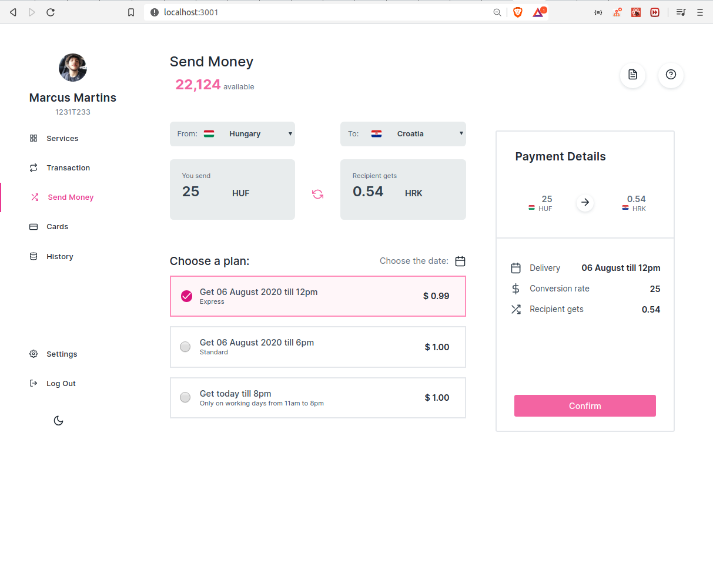
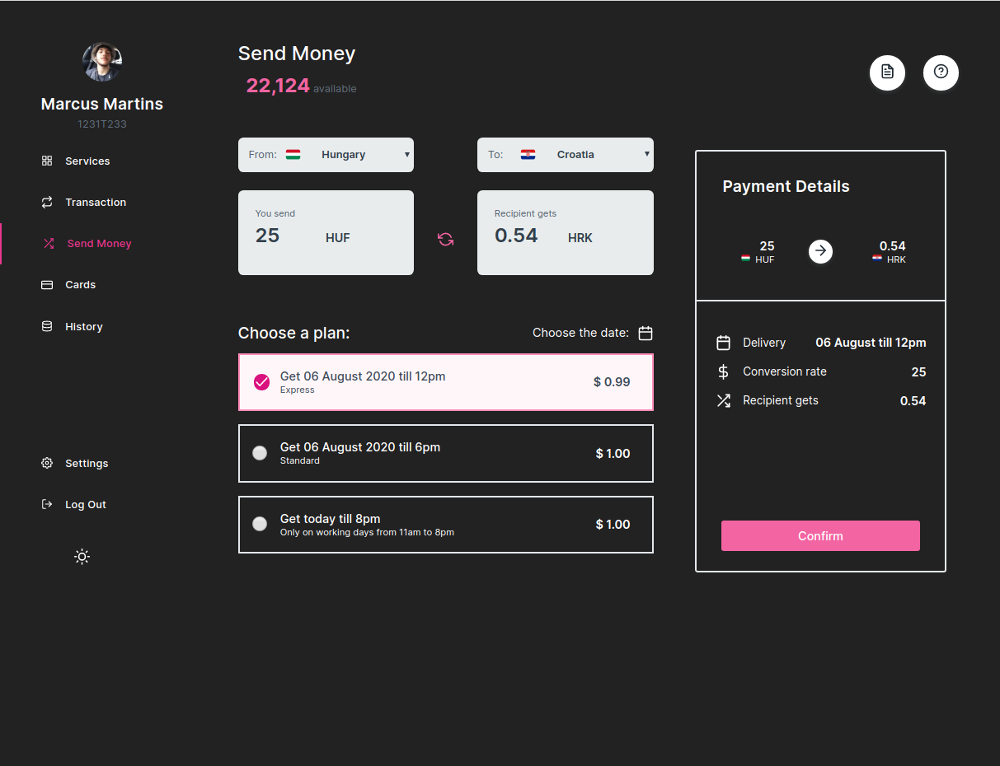

# Money Transfer

#### Languages: English or <a href="https://github.com/MarcusMartins38/datamonkeys/blob/master/README-pt.md">Português<a/>  

<p align="center">


</p>

## Sumary
[Intro](#intro) :door:  
[Some of Thecnologies](#some-of-thecnologies) :computer:  
[Step by step](#step-by-step) :open_book:  
[Accessing the Deploy](#or-you-can-access-the-deploy) :computer:


## Intro

It's a application that simulates a money transfer, that converts the money that you want to transfer to the value that it has in the country you want to send. It's using an Api that update the value of each money.


## Some of Thecnologies

**Front-End (ReactJS with TypeScript)**  
Some of the Libraries:
- axios
- date-fns
- react-day-picker
- react-icons
- react-router-dom
- styled-components


## Step by step

With Yarn
```
$ git clone https://github.com/MarcusMartins38/Money_Transfer.git
$ cd Money_Transfer
$ yarn
$ yarn start
```
With Npm

```
$ git clone https://github.com/MarcusMartins38/Money_Transfer.git
$ cd Money_Transfer
$ npm install
$ npm start
```

### Or you can access the Deploy

https://money-transfer.netlify.app


Obs: On this application, I'm using an Api to convert money, that gives me a limited access (1000 per month). If the app stop converting money, probably will be this.
